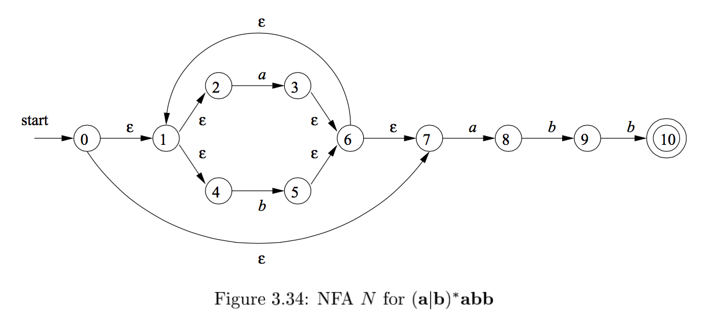

# Interface
The NFA interface has three most utilized methods which we will be using:

````cpp
void addState(std::string state_name, bool is_end=false);
void addTransition(std::string source_name, std::string destination_name, char symbol);
bool match(std::string x);
````

# Building the NFA
So let's say we want to build the NFA shown in the figure.



This NFA accepts languages given by the Regular Expression `(a|b)*abb`. 
We could use the Regexp class but let's say we want to build it manually.

## Creating the NFA

We first start by creating the NFA

````cpp
NFA nfa("0"); // NFA(std::string start_state_name)
````

This creates a NFA with a state named `0` as our entry state.

## Adding states
Next we have to add all the states
````cpp
nfa.addState("1");
nfa.addState("2");
nfa.addState("3");
nfa.addState("4");
nfa.addState("5");
...
nfa.addState("10", true);

````

## Adding transitions
Now we have to add the transition from state to state.

````cpp
// add the transitions
nfa.addTransition("0", "1", nfa.epsilon);
nfa.addTransition("0", "7", nfa.epsilon);

nfa.addTransition("1", "2", nfa.epsilon);
nfa.addTransition("1", "4", nfa.epsilon);

nfa.addTransition("2", "3", 'a');

nfa.addTransition("3", "6", nfa.epsilon);

...
````
The epsilon character is accessed via `nfa.epsilon` or `NFA::epsilon`.
It is of type `char`.

Note: If we try to add a state with a non-existing name then it 
will throw an exception.

## Matching a string
Finally we want to match a string against the NFA. For this we employ
the use of our match method.
````cpp
cout << "Match? " << nfa.match("abbababaabb") << endl;
````

With output:

````
./NFA
Match? 1
````